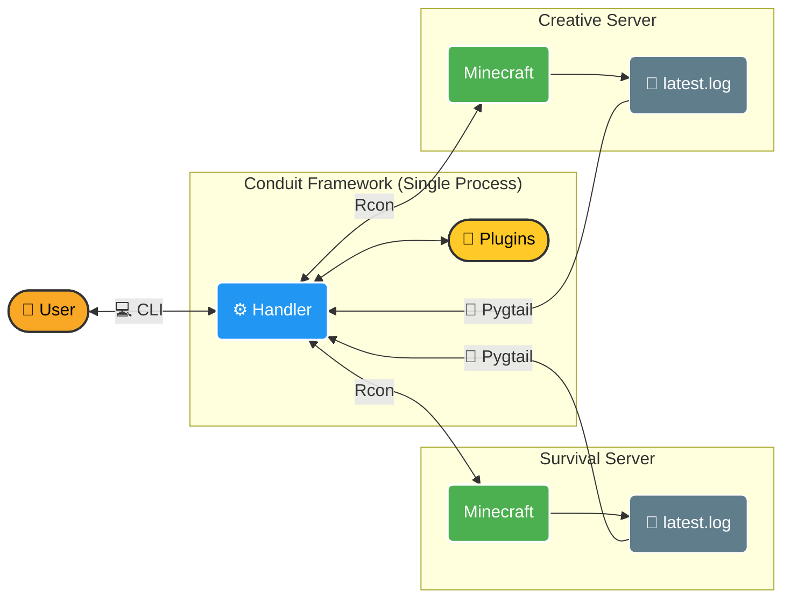
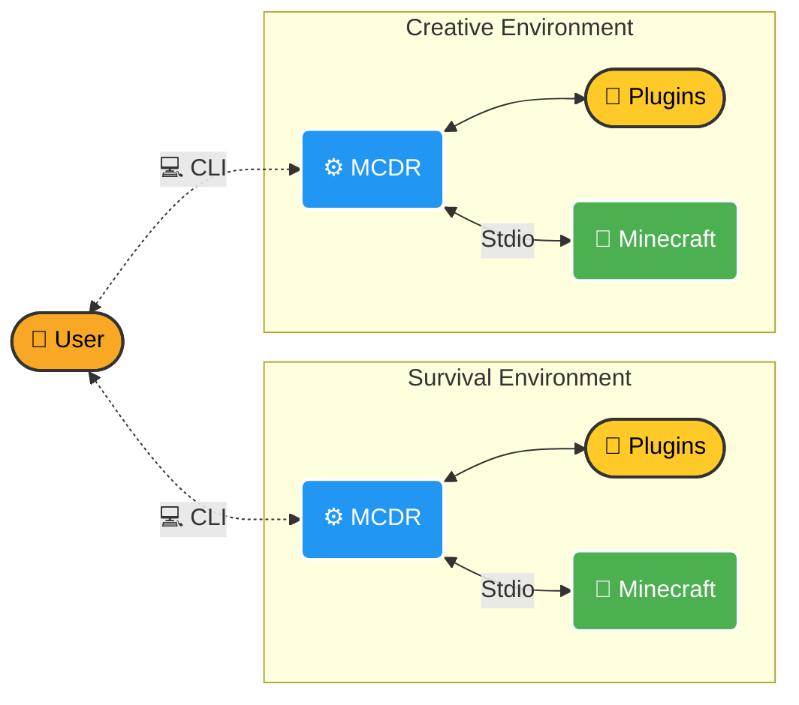

<div align="center">
  
  

  <br/><br/>

  [](https://pypi.org/project/mconduit)
  [](https://pypi.org/project/mconduit)
  [](https://github.com/1attila/Conduit/blob/main/LICENSE)

  <p><b>A powerful, lightweight, and independent Python framework for building Minecraft server plugins.</b></p>
</div>

---

## ✨ See it in action!
Conduit unlocks completely new possibilities for Vanilla Minecraft servers using the power of Python. Here are just a few examples of what you can build:

<table align="center">
  <tr>
    <td align="center" width="50%">
      <br>
      <b>📸 Renderer</b><br>
      Render in-game screenshots and automatically send them via a Discord bot!
    </td>
    <td align="center" width="50%">
      <br>
      <b>🏗️ Litematic</b><br>
      A pure, mod-less Python implementation for loading Litematica schematics directly into your world.
    </td>
  </tr>
  <tr>
    <td align="center" width="50%">
      <br>
      <b>🖼️ PictureLoader</b><br>
      Load high-quality, realistic images directly in-game utilizing `text_displays`.
    </td>
    <td align="center" width="50%">
      <br>
      <b>🖥️ Status</b><br>
      Fetch and monitor the real-time status of any machine running on the server.
    </td>
  </tr>
</table>

## 📖 What is Conduit?

Conduit is an easy-to-use tool that allows you to control one or multiple Minecraft servers using Python. 

It is designed with flexibility in mind and can be used in two ways:
1. **As a Standalone Program:** Run `python -m mconduit` from your console, and it will automatically load all your plugins, connect to your servers, and start listening to events.
2. **As an API Framework:** Import `mconduit` directly into your own Python applications to harness its powerful features—like Rcon dispatching, log-tailing, and data fetching—on your own terms.

## 🚀 Key Features

- **Completely Independent:** Runs in a parallel process. Update or restart Conduit without having to restart your Minecraft server!
- **Modern Python API:** Clean, intuitive, and strongly typed APIs for the best Developer Experience (DX).
- **Event-Driven:** Uses Pygtail to actively read server logs, efficiently extracting useful information to trigger your custom events.
- **Rcon Integration:** Execute commands and fetch player information seamlessly via Rcon.
- **Rich Feature Set:** Built-in support for Permissions, Custom Commands, Multilingual translation, JSON Text generation, Data fetching, and a comprehensive CLI.

---

## ⚙️ How it Works (Conduit vs MCDR)

Conduit is highly inspired by [MCDReforged](https://github.com/MCDReforged/MCDReforged), but with a major architectural difference: **Conduit doesn't run the Minecraft server directly.** It runs in a parallel process, communicating via Pygtail (Logs) and Rcon. 

This makes installation drastically easier, prevents server crashes if a plugin fails, and allows managing multiple servers from a single instance.

### The Conduit Architecture


This instead is a simplified scheme of how **MCDR** works:



### Why choose Conduit?

**Pros**:
- Easier and faster setup out of the box.

- Completely independent process (safeguards your MC server uptime).

- Update and reload plugins without stopping the Minecraft server.

- One central CLI to manage handlers/attributes across multiple servers.

- Extremely nice and pythonic API.


**Current Limitations**:

- Currently only fully supports Vanilla (Bukkit/Spigot/Paper support coming soon).

---

## 🛠️ Quick Start

It's much easier to set up than you might think! Install Conduit via pip:

```bash
pip install mconduit
```

To run Conduit directly from the console:
```bash
python -m mconduit
```

Check out our comprehensive [Wiki: How to Install](https://github.com/1attila/Conduit/wiki/How-to-install) for a full step-by-step configuration guide.

---

## 📚 Documentation
Everything you need to know about building plugins, configuring the server, and utilizing the API can be found on our [Wiki](https://github.com/1attila/Conduit/wiki).

## 🗺️ Roadmap
We are actively developing Conduit. Future updates include:
- Support for Bukkit / Spigot / Paper / Forge / Fabric log formats.
- Built-in graphical UIs.
- More event hooks and deeper data fetching.
- Further CLI enhancements.

## 🤝 Contributing
Contributions are more than welcome! Whether it's reporting bugs, suggesting features, writing documentation, or creating awesome new plugins.
- **Discord:** Contact me directly at `attila8829` or join [MultiTech discord](https://discord.gg/uVUnNbVmhh)
- **Pull Requests:** Feel free to open an issue or PR on this repository!

## 💙 Credits
This project was heavily inspired by the amazing work done by the [MCDReforged](https://github.com/MCDReforged) team. Huge credits to them for pioneering this space!
